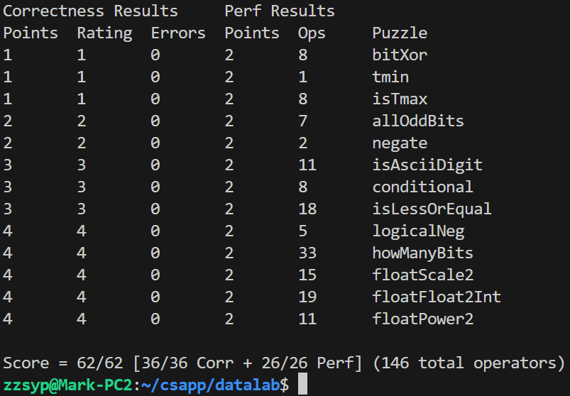

# Datalab实验报告

### 10235501419	李佳亮

### 1. bitXor

**实现异或运算。**

考虑`A^B = (~A&B) | (~B&A)`


再用 `~` 和 `& `替换 `|`

由`X|Y = ~(~X&~Y)`

所以原式等于`~(~(~A&B)&~(~B&A))`。

```c
int bitXor(int x, int y) {
	return ~(~(~x&y)&~(~y&x));
}
```

### 2. tmin

**返回`int`补码最小值。**

32位补码的最小值即为`100...0`，也即`1<<31`。

```c
int tmin(void) {
	return 1<<31;
}
```

### 3. isTmax

**判断一个整数是否是补码最大值。**

`Tmax`具有独特的性质`~x = x+1`，但-1也具有这个性质。

然而，`~Tmax = Tmax+1 = 100..00 = -1`, 但`~(-1) = -1+1 = 0`。

所以判断条件即为`~x == x+1 && !!(~x)`（使用`!!`可把整数映射为布尔数）。

最后，由于`&&`两侧都为布尔数，故可以用`&`代替`&&`；

由于`a=b`当且仅当`a^b=0`，所以用`!`和`^`可以替换`==`。

```c
int isTmax(int x) { 
	return !((~x)^(x+1)) & !!(~x); 
}
```

### 4. allOddBits

**判断 `x` 的奇数位是否全部 1。**

注意位的序号是从0开始计的。

构造掩码`mask = 1010...10`，那么奇数位均为1的x应当满足`x & mask == model`。

与第3题同理，用`!`和`^`代替`==`即可。

```C
int allOddBits(int x) {  
	int tmp, mask; //注意C89的规则，变量要统一先声明
	tmp = 0xAA + (0xAA << 8);
	mask = tmp + (tmp << 16); 
	return !((x&mask)^mask);
}
```

### 5. negate

**对 `x `进行求负操作。**

`x`的相反数等于`~x+1`。

```c
int negate(int x) {
	return ~x+1;
}
```

### 6.isAsciiDigit

**判断 `x `是否在`0x30 ~ 0x39` 之间。**

`0x30 = 0b110000`, `0x39 = 0b111001`。

观察到满足条件的`x`的第5,6位（位从1记）一定是1且`x`没有更高的位，并且我们要取x的后四位进行判断。

考虑异或运算：与1异或取反，与0异或不变，这正好符合我们的要求。

取`mask = 0b111111`，记`a = x ^ mask`。

若`x`满足要求，那么`a`应该没有第4位及以后更高的位，且只有以下几种取值情况。

|   x    |  a   |
| :----: | :--: |
| 110000 | 1111 |
| 110001 | 1110 |
| 110010 | 1101 |
| 110011 | 1100 |
| 110100 | 1011 |
| 110101 | 1010 |
| 110110 | 1001 |
| 110111 | 1000 |
| 111000 | 0111 |
| 111001 | 0110 |

**条件1.**`!(a>>4)`：`a`没有第4位及以后更高的位；

**条件2.**`a>>3 | (a+1)>>3 | (a+2)>>3`：所有的满足条件的`x`对应的`a`的首位都是1 或者 加1或2后首位为1。

```c
int isAsciiDigit(int x) {
	int a = x^0x3F;   //a = x ^ 0b111111;
	return (!(a>>4)) & ( a>>3 | (a+1)>>3 | (a+2)>>3 ); 
}
```

### 7. conditional

**模拟三元运算符`? :`。**

思路：假定返回表达式的形式为`val & y + ~val & z`，若`x`不为0则`val`为全1，若`x`为0则`val`为全0。

先用`!!`把`x`转为0或1的布尔值，再用`f(x): x<<31>>31`把`{0,1}`映射到`{00...0,11...1}`。

```c
int conditional(int x, int y, int z) {
	int val = (!!x)<<31>>31;
	return (val & y) + (~val & z);
}
```

**注1.** 另一种把`{0,1}`映射到`{00...0,11...1}`的方法：利用1的补码是-1（11111111），0的补码是0，即利用`f(x): ~x+1`；

**注2.** 可以用`|`代替`+`。

### 8. isLessOrEqual

**判断是否`x<=y`。**

两种情况：

1. **若`x`和`y`同号**，`y>=x`，则`y-x>=0`，`y-x`的首位应为0。
2. **若`x`和`y`的符号不同**，`y-x`会产生溢出，数学上的`y-x>=0`当且仅当`y`为正，`x`为负。

```c
int isLessOrEqual(int x, int y) {
	int flag1, flag2;
	flag1 = (~(y>>31)^(x>>31)) & !((y+(~x+1))>>31&1);	//x,y同号且y-x首位为0
	flag2 = (~y>>31&1) & (x>>31&1);	//x负y正
	return flag1 | flag2;
}
```

### 9. logicalNeg

**实现逻辑非`!`操作，即`x`为0则返回1，`x`非0则返回0。**

除了0之外的数，相反数的最高位和该数的最高位二者至少有一个是1，

记表达式 `a = (x|(~x+1))>>31`。

 对于`x = 0`, `a = 0`； 对于`x != 0`, `a = 11111111 = -1`

因此返回`a + 1`即可满足条件

```c
int logicalNeg(int x) {
	return ((x|(~x+1))>>31) + 1;
}
```


### 10. howManyBits

**返回表示整数`x`需要的最小位数。**

对于正数，即求使`x>>k=0`（全0）的最小`k`再加1（正数的位模式首位必须为0）；

对于负数，即求使`x>>k=-1`（全1）的最小`k`再加1（负数的位模式首位必须为1）。

我们可以把负数的情况化归为正数的情况，即若`x`为负数，`howManyBits(x)=howManyBits(~x)`。

考虑按位异或运算：与0异或仍为本身，与1异或则取反，即`x^0=x`，`x^-1=~x`，通过与`x>>31`按位异或可以实现把`x`统一“变为正数” 。

而要求`k`，我们可以用“二分”的想法，不断二分，可以画出决策树来理解。

```c
int howManyBits(int x) {
	int mask, k, disp, curHigh16BitsNonZero, curHigh8BitsNonZero, curHigh4BitsNonZero, curHigh2BitsNonZero, curHigh1BitNonZero;

	mask = x>>31; //若x为负数，mask=全1；若x为正数，mask=全0
	x = x ^ mask; //若x为负数则取反；若x为正数则不变
  	
	/*
	 * 要求k，我们可以用“二分”的想法，不断二分，可以画出决策树来理解
	 */
	k = 0;
	curHigh16BitsNonZero = !!(x>>16);
	disp = curHigh16BitsNonZero << 4; //位移量，若k>16，disp=16；否则disp=0
	k = k + disp;  //若k>16，k先加16；否则k不变
	x = x >> disp;   //“框住”x的“未被确认”的那16位

	//后面同理
	curHigh8BitsNonZero = !!(x>>8);
	disp = curHigh8BitsNonZero << 3;
	k = k + disp;
	x = x >> disp;

	curHigh4BitsNonZero = !!(x>>4);
	disp = curHigh4BitsNonZero << 2;
	k = k + disp;
	x = x >> disp;

	curHigh2BitsNonZero = !!(x>>2);
	disp = curHigh2BitsNonZero << 1;
	k = k + disp;
	x = x >> disp;

 	curHigh1BitNonZero = !!(x>>1);
	disp = curHigh1BitNonZero;
	k = k + disp;
	x = x >> disp;

	k = k + x;    
	//容易被遗忘的一步：若最后还剩的x是1，这个1也需要被计入（即curBitNonZero）

	return k+1;
}
```

### 11. floatScale2

**求以`unsigned`形式表示的浮点数 `uf` `*2` 之后的位表示。**

解析出`uf`的`float`表示的各个部分，并针对三种类型分别进行判断、运算。

**NaN或无穷大**：返回原本的数。

**非结构化的数**：直接把`exp`和`frac`部分的总体左移1位，就可以实现`uf*2`。（也许它会变为结构化的数，非结构化数到结构化数是可以平滑过渡的。）

**结构化的数**：只需要`E+=1`即可实现乘以2。

```c
unsigned floatScale2(unsigned uf) {
	// 我们要把uf解析出float变量的各个部分
	int s, exp, frac;
	s = uf>>31&1;
	exp = uf>>23&0xff;
	frac = uf&0x7fffff;
	// 针对三种类型进行判断
	// NaN或无穷大
	if(exp == 0xff){
		return uf;
	}
	//非规格化的数，表示0或接近0的数
	else if(exp == 0){
		// 可以直接把exp和frac部分的总体左移1位，就可以实现uf*2，也许它会变为结构化的数
		return s<<31 | uf<<1;
	}
	// 结构化的数
	else{
		// 只需要E+1即可实现乘以2
   		return s<<31 | (exp+1)<<23 | frac;
	}
}
```

### 12. floatFloat2Int

**求以`unsigned`形式表示的浮点数 `uf` 强制转换为整数后的位表示。**

仍拆解`uf`，大方向上分三类情况。

**非规格化数**：其绝对值小于 1，根据整数截断规则，结果直接返回 0。

**inf和NaN**：一定会超出int的表示范围，返回特殊值 `0x80000000` 作为溢出表示。

**规格化数**：

- 通过指数偏移量 `E = exp - 127` 计算浮点数的实际指数。
- 如果 `E` 超出 32 位整数能表示的范围，即`E>31`，返回溢出值 `0x80000000`。
- 如果 `E < 0`，表示绝对值小于 1，结果也为 0。
- 如果`0 <= E <= 31`，计算出对应的`M`并移动相对应的小数点。

```c
int floatFloat2Int(unsigned uf) {
  int s, exp, frac, E, M;
  // 拆解
  s = uf>>31&1;
  exp = uf>>23&0xff;
  frac = uf&0x7fffff;
  // 非规格化的数：绝对值小于1，根据截断规则，返回0
  if(exp == 0){
    return 0;
  }
  // inf和NaN：一定会超出int的表示范围
  else if(exp == 255){
    return 0x80000000u;
  }
  // 规格化的数
  else{
    // 计算规格化的数的E
    E = exp - 127;
    // 超出范围
    if(E > 31){
      return 0x80000000u;
    }
    // E<0能确定|f|<1，这是因为2^E<=0.5，而M<2，故|f|<1
    else if(E < 0){
      return 0;
    }
    else{
      /* 
       * 注意float向int强制转换并不是直接简单地除去frac部分
       * M = 1.(frac), |V| = M * 2^E
       * 理解的关键：M乘以2^E等价于M的小数点右移E位
       * 我们要判断uf的小数点在哪个位置，也就是M*2^E的小数点在哪个位置
       */
      M = 1<<23 | frac; //这里的M实际上是M*2^23
      if(E >= 23){
        M = M << (E-23);  //把小数点少往右移的移过去
      }else{
        M = M >> (23-E);  //把小数点多往右移的移回来
      }
      // 考虑符号位
      if(s){
        M = ~M + 1; //取相反数
      }
      return M;
    }
  }
}
```

### 13. floatPower2

**计算浮点数 `2^x`的位表示。**

关注`float`各个分类所能表达的正数`V` `(s=0)`的范围。   `V = M * 2^E`

1. **规格化的数** `1 <= exp <= 254`

​	`M = 1.(frac), E = exp - 127, exp∈[1, 254];`

​	`M∈[1, 2), E∈[-126, 127];`

​	故`V∈[2^{-126}, 2^128)`

2. **非规格化的数** `exp = 0`

​	只考虑`frac`不全为0时的情况（即正数的情况）

​	`M!=0`时，有`M∈[2^{-23}, 1)`,

​	故`V∈[2^{-149}, 2^{-126})`

3. **`NaN`或`+inf` ** `exp = 255`

判断`2^x`是哪一类数，并根据那类数的规则返回对应的值。

```c
unsigned floatPower2(int x) {
  int exp, frac;
  // 极小的数
  if(x < -149){
    exp = 0;
    frac = 0;
  }
  // 非规格化的数 V = frac * 2^{-126} = 2^x  =>  frac = 2^(x + 126) = 1 * 2^(x + 126)
  else if(x < -126){
    exp = 0;
    frac = 1 << (x + 126 + 23); //还要左移23是因为保证frac是小数部分的解释方式
  }
  // 规格化的数 V = M * 2^{exp - 127} = 2^x  => x由exp贡献，M = 1，即frac = 0，exp = x + 127
  else if(x < 128){
    frac = 0;
    exp = x + 127;
  }
  // inf 
  else{
    exp = 0xff;
    frac = 0;
  }
   
  return (exp<<23) | frac;
}
```


### 技巧总结

1.  `!!x`可以将整数`x`映射到`{0,1}`；
2. `a=b`当且仅当`a^b=0`，故`a==b`等价于`!(a^b)`；

3. `f(x): ~x+1`可以把`{0,1}`映射到`{00...0,11...1}`；
4. 取a的符号位：`a>>31&1`。
5. 按位异或运算的两种理解与应用方式：
   1. 相同为0，不同为1，即`x^x = 0`，`x^~x = 11...1 = -1`；
   2. 与0异或仍为本身，与1异或则取反，即`x^0 = x`，`x^-1 = ~x`。


### 结果截图


