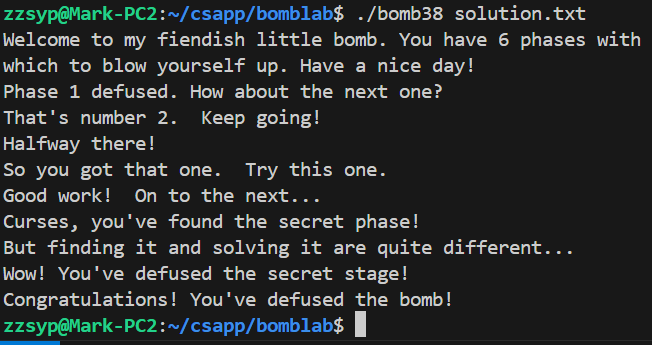

# BombLab 实验报告

## 10235501419 李佳亮	2024/10/22

## 一、文件/工具

- bomb38
- bomb.c
- gdb


## 二、准备工作

### 1. 生成反汇编文件

执行：

```bash
objdump-d bomb38 > bomb38.asm
```

获得反汇编文件bomb38.asm，便于整体阅读。

### 2. 阅读`bomb.c`

```c
// ......
	else if (argc == 2) {
	if (!(infile = fopen(argv[1], "r"))) {
	    printf("%s: Error: Couldn't open %s\n", argv[0], argv[1]);
	    exit(8);
	}
    }
	// ......
    /* Hmm...  Six phases must be more secure than one phase! */
    input = read_line();             /* Get input                   */
    phase_1(input);                  /* Run the phase               */
    phase_defused();                 /* Drat!  They figured it out!
				      * Let me know how they did it. */
    printf("Phase 1 defused. How about the next one?\n");

    // ......

    /* Wow, they got it!  But isn't something... missing?  Perhaps
     * something they overlooked?  Mua ha ha ha ha! */
// ......

```

通过阅读`bomb.c`，可以知道拆弹过程共分7阶段，phase_1~6以及最后的隐藏阶段。每一阶段系统从输入中读一行字符串，输入可以是标准输入`stdin`或从命令行参数中指定的文件中获得。我们在程序目录下新建一个文本文档`solution.txt`作为运行时的命令行参数，每解开一阶段，将该阶段的答案追加到其中。注意，将每一题的答案写入solution.txt后，行尾需要有一个换行符。

### 3. 用到的C库函数

本次实验中用到的不熟悉的C库函数有`sscanf`和`strtol`。

- `sscanf`

  **声明**

  ```c
  int sscanf(const char *str, const char *format, ...)
  ```

  **参数**

  `sscanf`与`scanf`相似，只是`scanf`的字符串源为标准输入，而`sscanf`的字符串源是传入的第一个参数`str`。

  第二个参数为解读格式，后面的附加参数即为解读后的变量要存储的地址。

  **返回值**

  如果成功，该函数返回成功匹配和赋值的个数，否则返回`EOF`。

- `strtol`（即string to long）

  **声明**

  ```c
  long strtol(const char *str, char **endptr, int base)
  ```

  **参数**

  `str`为要转换成`long`类型的字符串，`endptr`的值由函数指向`str`中有效数字后的下一个字符（如果字符串是纯数字`*endptr == '\0'`），`base`决定把`str`转为几进制。

  **返回值**

  返回转换成的`long`类型值。如果输入字符串不是纯数字，返回`0`。
  
### 4 . 常用gdb命令

见[yanbinghu.com/2019/04/20/41283.html](https://www.yanbinghu.com/2019/04/20/41283.html)

### 5. 约定

把寄存器`%rdi`,`%rsi`,...中存放的变量依次称为`arg1`,`arg2`,...。

## 三、实验过程

### phase_1

```assembly
00000000000015e7 <phase_1>:
    15e7:	f3 0f 1e fa          	endbr64 
    15eb:	48 83 ec 08          	sub    $0x8,%rsp				# 维护栈帧
    15ef:	48 8d 35 5a 1b 00 00 	lea    0x1b5a(%rip),%rsi        # 3150 <_IO_stdin_used+0x150>   # arg2 = 0x3150
    15f6:	e8 f8 04 00 00       	callq  1af3 <strings_not_equal> # 调用strings_not_equal函数
    15fb:	85 c0                	test   %eax,%eax
    15fd:	75 05                	jne    1604 <phase_1+0x1d>		# 要求字符串相同，否则爆炸
    15ff:	48 83 c4 08          	add    $0x8,%rsp				# 回收栈帧
    1603:	c3                   	retq   
    1604:	e8 fe 05 00 00       	callq  1c07 <explode_bomb>  
    1609:	eb f4                	jmp    15ff <phase_1+0x18>
```

- `sub  $0x8,%rsp`和`add  $0x8,%rsp`的操作是在给`phase_1()`函数维护一个独立的栈帧，以后每一阶段都会出现类似的代码。

- 简单看函数`strings_not_equal(arg1, arg2)`的反汇编代码，它返回命题`字符串*arg1与*arg2相同`的布尔值。

- `15ef`处把地址`0x3150`（**注**. 这是虚拟地址、相对地址，该地址在程序运行时会重定向到真实物理内存地址）赋给了`arg2`，只有当我们的输入字符串（即`*arg1`）与`*arg2`相同才不会爆炸。

所以我们要输入地址`0x3150`中存放的字符串。输入`gdb bomb38`进入gdb调试程序`bomb38`（尚不运行），输入`x/s 0x3150`得到字符串为`"Border relations with Canada have never been better."`。

### phase_2

```assembly
000000000000160b <phase_2>:
    160b:	f3 0f 1e fa          	endbr64 
    160f:	55                   	push   %rbp 
    1610:	53                   	push   %rbx					# callee保存寄存器
    1611:	48 83 ec 28          	sub    $0x28,%rsp
    1615:	64 48 8b 04 25 28 00 	mov    %fs:0x28,%rax		# 用于栈溢出保护	
    161c:	00 00 
    161e:	48 89 44 24 18       	mov    %rax,0x18(%rsp)
    1623:	31 c0                	xor    %eax,%eax			# 返回值置0
    1625:	48 89 e6             	mov    %rsp,%rsi			# arg2 = 栈顶
    1628:	e8 06 06 00 00       	callq  1c33 <read_six_numbers>  # 调用read_six_numbers
    162d:	83 3c 24 00          	cmpl   $0x0,(%rsp)  
    1631:	78 0a                	js     163d <phase_2+0x32>  # 要求num1 >= 0
    
 # 1633 - 165f：循环结构   
    1633:	48 89 e5             	mov    %rsp,%rbp    		# rbp = 当前栈顶
    1636:	bb 01 00 00 00       	mov    $0x1,%ebx    		# ebx = 1
    163b:	eb 13                	jmp    1650 <phase_2+0x415>	# goto .L1
    163d:	e8 c5 05 00 00       	callq  1c07 <explode_bomb>
    1642:	eb ef                	jmp    1633 <phase_2+0x28>
.Loop:    
    1644:	83 c3 01             	add    $0x1,%ebx    		# ebx += 1
    1647:	48 83 c5 04          	add    $0x4,%rbp			# rbp += 4
    164b:	83 fb 06             	cmp    $0x6,%ebx
    164e:	74 11                	je     1661 <phase_2+0x56>  # if ebx == 6，成功
.L1:
    1650:	89 d8                	mov    %ebx,%eax			# 返回值 = ebx
    1652:	03 45 00             	add    0x0(%rbp),%eax		# 返回值 += *(rbp) 
    1655:	39 45 04             	cmp    %eax,0x4(%rbp)   
    1658:	74 ea                	je     1644 <phase_2+0x39>  # 要求返回值 == *(rbp+4)，goto .Loop
    165a:	e8 a8 05 00 00       	callq  1c07 <explode_bomb>
    165f:	eb e3                	jmp    1644 <phase_2+0x39>	
    
    1661:	48 8b 44 24 18       	mov    0x18(%rsp),%rax
    1666:	64 48 2b 04 25 28 00 	sub    %fs:0x28,%rax
    166d:	00 00 
    166f:	75 07                	jne    1678 <phase_2+0x6d>
    1671:	48 83 c4 28          	add    $0x28,%rsp
    1675:	5b                   	pop    %rbx
    1676:	5d                   	pop    %rbp
    1677:	c3                   	retq   
    1678:	e8 d3 fb ff ff       	callq  1250 <__stack_chk_fail@plt>
    
0000000000001c33 <read_six_numbers>:						# 被phase_2调用时，arg1 = 我们输入，arg2 = 栈顶位置
    1c33:	f3 0f 1e fa          	endbr64 
    1c37:	48 83 ec 08          	sub    $0x8,%rsp
    1c3b:	48 89 f2             	mov    %rsi,%rdx    	# arg3 = 栈顶
    1c3e:	48 8d 4e 04          	lea    0x4(%rsi),%rcx   # arg4 = 栈顶+4
    1c42:	48 8d 46 14          	lea    0x14(%rsi),%rax  # 返回值 = 栈顶+20
    1c46:	50                   	push   %rax 			# 返回值压入栈
    1c47:	48 8d 46 10          	lea    0x10(%rsi),%rax  # 返回值 = 栈顶+16
    1c4b:	50                   	push   %rax 			# 返回值压入栈
    1c4c:	4c 8d 4e 0c          	lea    0xc(%rsi),%r9    # arg6 = 栈顶+12
    1c50:	4c 8d 46 08          	lea    0x8(%rsi),%r8    # arg5 = 栈顶+8
    1c54:	48 8d 35 c8 16 00 00 	lea    0x16c8(%rip),%rsi# 3323 <array.0+0x143>  
    														# arg2 = 0x3323，*arg2="%d %d %d %d %d %d"
    1c5b:	b8 00 00 00 00       	mov    $0x0,%eax		# 返回值置0
    1c60:	e8 9b f6 ff ff       	callq  1300 <__isoc99_sscanf@plt>
    1c65:	48 83 c4 10          	add    $0x10,%rsp
    1c69:	83 f8 05             	cmp    $0x5,%eax    
    1c6c:	7e 05                	jle    1c73 <read_six_numbers+0x40> # 要求返回值>=6，即要读出6个数字
    1c6e:	48 83 c4 08          	add    $0x8,%rsp
    1c72:	c3                   	retq   
    1c73:	e8 8f ff ff ff       	callq  1c07 <explode_bomb>  
```

- `push  %rbp`是因为`%rbp`为被调用者保存寄存器；`mov  %fs:0x28,%rax`等代码是用于处理栈溢出异常。以后每一阶段都会出现类似的代码。

- `read_six_numbers()`中，通过`x/s 0x3323`可以得到`arg2`为`%d %d %d %d %d %d`。`sscanf()`需要8个参数才能从我们输入的字符串中读取6个数字，而寄存器最多只能传输6个参数，因此第7，8个参数，`栈顶+16`和`栈顶+20`要分别压入栈。

也就是说，从我们输入的字符串读取的六个数字被依次存放进了`栈顶`~`栈顶+20`位置（每个数字占4字节），我们把其中存放的数字分别记为`num1`~`num6`。

`1633` ~ `165f`为循环结构，其整体逻辑如下

```clike
(rbp) = num1, ebx = 1
while ebx != 6:
    if ebx + (rbp) != 下一个数字
        爆炸
    ebx ++, (rbp) = 下一个数字
```

所以我们得到要求：
$$
num1≥0,\\num2=num1+1,\\num3=num2+2,\\...\\num6 = num5+5
$$
序列如`1,2,4,7,11,16`即满足要求。

### phase_3

```assembly
000000000000167d <phase_3>:
    167d:	f3 0f 1e fa          	endbr64 
    1681:	48 83 ec 18          	sub    $0x18,%rsp
    1685:	64 48 8b 04 25 28 00 	mov    %fs:0x28,%rax
    168c:	00 00 
    168e:	48 89 44 24 08       	mov    %rax,0x8(%rsp)
    1693:	31 c0                	xor    %eax,%eax
    1695:	48 8d 4c 24 04       	lea    0x4(%rsp),%rcx			# arg4 = 栈顶+4
    169a:	48 89 e2             	mov    %rsp,%rdx				# arg3 = 栈顶
    169d:	48 8d 35 8b 1c 00 00 	lea    0x1c8b(%rip),%rsi        # 332f <array.0+0x14f>  
    																# *arg2 = "%d %d"
    16a4:	e8 57 fc ff ff       	callq  1300 <__isoc99_sscanf@plt>
    16a9:	83 f8 01             	cmp    $0x1,%eax
    16ac:	7e 1a                	jle    16c8 <phase_3+0x4b>		# 确保有两个数
																	# num1存在栈顶，num2存在栈顶+4
    16ae:	83 3c 24 07          	cmpl   $0x7,(%rsp)
    16b2:	77 65                	ja     1719 <phase_3+0x9c>  	# 要求0 <= num1 <= 7(ja提示了元素类型)
    16b4:	8b 04 24             	mov    (%rsp),%eax				# 返回值 = num1
    16b7:	48 8d 15 02 1b 00 00 	lea    0x1b02(%rip),%rdx        # 31c0 <_IO_stdin_used+0x1c0>
    																# arg3 = 0x31c0
    16be:	48 63 04 82          	movslq (%rdx,%rax,4),%rax
    16c2:	48 01 d0             	add    %rdx,%rax				# 返回值 = M[arg3 + 4*num1] + arg3
    16c5:	3e ff e0             	notrack jmpq *%rax 				# 跳转到 M[arg3 + 4*返回值] + arg3
    																# 猜测为16ef后面的分支 8个分支对应num1的0-7

    16c8:	e8 3a 05 00 00       	callq  1c07 <explode_bomb>

    16cd:	eb df                	jmp    16ae <phase_3+0x31>		# 无入口
    16cf:	b8 5a 02 00 00       	mov    $0x25a,%eax				# 无入口

# 出口
    16d4:	39 44 24 04          	cmp    %eax,0x4(%rsp)
    16d8:	75 52                	jne    172c <phase_3+0xaf>		# 要求num2 = 返回值
    16da:	48 8b 44 24 08       	mov    0x8(%rsp),%rax
    16df:	64 48 2b 04 25 28 00 	sub    %fs:0x28,%rax
    16e6:	00 00 
    16e8:	75 49                	jne    1733 <phase_3+0xb6>
    16ea:	48 83 c4 18          	add    $0x18,%rsp   
    16ee:	c3                   	retq
# 八条分支对应num1的0-7
    16ef:	b8 a0 02 00 00       	mov    $0x2a0,%eax  
    16f4:	eb de                	jmp    16d4 <phase_3+0x57>
    16f6:	b8 42 01 00 00       	mov    $0x142,%eax
    16fb:	eb d7                	jmp    16d4 <phase_3+0x57>
    16fd:	b8 83 02 00 00       	mov    $0x283,%eax
    1702:	eb d0                	jmp    16d4 <phase_3+0x57>
    1704:	b8 3b 01 00 00       	mov    $0x13b,%eax
    1709:	eb c9                	jmp    16d4 <phase_3+0x57>
    170b:	b8 7f 03 00 00       	mov    $0x37f,%eax				# 对应num1 = 6
    1710:	eb c2                	jmp    16d4 <phase_3+0x57>
    1712:	b8 7a 02 00 00       	mov    $0x27a,%eax
    1717:	eb bb                	jmp    16d4 <phase_3+0x57>

    1719:	e8 e9 04 00 00       	callq  1c07 <explode_bomb>

    171e:	b8 00 00 00 00       	mov    $0x0,%eax
    1723:	eb af                	jmp    16d4 <phase_3+0x57>
    1725:	b8 52 02 00 00       	mov    $0x252,%eax
    172a:	eb a8                	jmp    16d4 <phase_3+0x57>

    172c:	e8 d6 04 00 00       	callq  1c07 <explode_bomb>
    1731:	eb a7                	jmp    16da <phase_3+0x5d>
    1733:	e8 18 fb ff ff       	callq  1250 <__stack_chk_fail@plt>
```

阅读代码，我们可以推断出

- `0 <= num1 <=7`。

- `16c5 notrack jmpq *%rax` 跳转到`M[arg3 + 4*num1] + arg3`，猜测为`16ef`后面的分支 8个分支对应`num1 = 0~7`，这8个分支会各自改变`返回值`，然后跳转到判断`num2`是否等于`返回值`。（`arg3 = 0x31c0`）
- `num2 = 返回值`则拆弹成功。

那我们可以随意代入一个`num1 = 6`，算出`arg3 + 4*num1 = 0x31d8`，用gdb查看`x/xw 0x31d8`得到`0xffffe54b`，为`0x1ab5`的相反数（先-1后取反），则会跳转到`0x31c0 - 0x1ab5 = 0x170b`处，`返回值 = 0x37f`，即`num2 = 895`。

所以一个答案为`6 895`。

### phase_4

```assembly
000000000000176e <phase_4>:
    176e:	f3 0f 1e fa          	endbr64 
    1772:	48 83 ec 18          	sub    $0x18,%rsp
    1776:	64 48 8b 04 25 28 00 	mov    %fs:0x28,%rax
    177d:	00 00 
    177f:	48 89 44 24 08       	mov    %rax,0x8(%rsp)
    1784:	31 c0                	xor    %eax,%eax
    1786:	48 8d 4c 24 04       	lea    0x4(%rsp),%rcx   		# arg4 = 栈顶+4
    178b:	48 89 e2             	mov    %rsp,%rdx				# arg3 = 栈顶
    178e:	48 8d 35 9a 1b 00 00 	lea    0x1b9a(%rip),%rsi        # 332f <array.0+0x14f>  
    																# *arg2 = "%d %d"
    1795:	e8 66 fb ff ff       	callq  1300 <__isoc99_sscanf@plt>
    179a:	83 f8 02             	cmp    $0x2,%eax
    179d:	75 06                	jne    17a5 <phase_4+0x37>  	# 确保有两个数
    																# num1存在栈顶，num2存在栈顶+4
    179f:	83 3c 24 0e          	cmpl   $0xe,(%rsp)
    17a3:	76 05                	jbe    17aa <phase_4+0x3c>  	# 要求0 <= num1 <= 14
    17a5:	e8 5d 04 00 00       	callq  1c07 <explode_bomb>
    17aa:	ba 0e 00 00 00       	mov    $0xe,%edx				# arg3 = 14
    17af:	be 00 00 00 00       	mov    $0x0,%esi				# arg2 = 0  
    17b4:	8b 3c 24             	mov    (%rsp),%edi				# arg1 = num1
    17b7:	e8 7c ff ff ff       	callq  1738 <func4>				# 调用func4()
    17bc:	83 f8 13             	cmp    $0x13,%eax   
    17bf:	75 07                	jne    17c8 <phase_4+0x5a>		# 要求返回值 = 19
    17c1:	83 7c 24 04 13       	cmpl   $0x13,0x4(%rsp)
    17c6:	74 05                	je     17cd <phase_4+0x5f>  	# 要求num2 = 19(已解决)
    17c8:	e8 3a 04 00 00       	callq  1c07 <explode_bomb>
    17cd:	48 8b 44 24 08       	mov    0x8(%rsp),%rax   
    17d2:	64 48 2b 04 25 28 00 	sub    %fs:0x28,%rax
    17d9:	00 00 
    17db:	75 05                	jne    17e2 <phase_4+0x74>
    17dd:	48 83 c4 18          	add    $0x18,%rsp
    17e1:	c3                   	retq   
    17e2:	e8 69 fa ff ff       	callq  1250 <__stack_chk_fail@plt>

```

阅读代码，可以推断出：

- `0 <= num1 <= 14`且`func4(num1, 0, 14) = 19`。
- `num2 = 19`。

那么只需要解出方程`func4(num1, 0, 14) = 19, 0 <= num1 <= 14`即可。

```assembly
0000000000001738 <func4>:										# func4(arg1, arg2, arg3)
    1738:	f3 0f 1e fa          	endbr64 
    173c:	53                   	push   %rbx
    173d:	89 d0                	mov    %edx,%eax
    173f:	29 f0                	sub    %esi,%eax    		# 返回值 = arg3 - arg2
    1741:	89 c3                	mov    %eax,%ebx    		# ebx = arg3 - arg2
    1743:	c1 eb 1f             	shr    $0x1f,%ebx   		# 逻辑右移 ebx>>= 31，就是取符号位，0或-1
    1746:	01 c3                	add    %eax,%ebx    		# ebx += arg3 - arg2
    1748:	d1 fb                	sar    %ebx         		# 默认第二个操作数是1
    174a:	01 f3                	add    %esi,%ebx    	
    								# 最终，ebx = 1/2 * [arg3 - arg2 + 符号(0/-1)] + arg2
    174c:	39 fb                	cmp    %edi,%ebx
    174e:	7f 06                	jg     1756 <func4+0x1e>    # if ebx > arg1
    1750:	7c 10                	jl     1762 <func4+0x2a>    # if ebx < arg1
# if %ebx = arg1（递归出口）
    1752:	89 d8                	mov    %ebx,%eax    		# 返回值 = rbx
    1754:	5b                   	pop    %rbx         		# 恢复被调用者保存寄存器
    1755:	c3                   	retq   
# if %ebx > arg1
    1756:	8d 53 ff             	lea    -0x1(%rbx),%edx		# arg3 = rbx-1
    1759:	e8 da ff ff ff       	callq  1738 <func4>			# fun4()
    175e:	01 c3                	add    %eax,%ebx			# rbx = rbx + 返回值
    1760:	eb f0                	jmp    1752 <func4+0x1a>	# 跳到递归出口
# if %ebx < arg1
    1762:	8d 73 01             	lea    0x1(%rbx),%esi		# arg2 = rbx+1
    1765:	e8 ce ff ff ff       	callq  1738 <func4>			# fun4()    
    176a:	01 c3                	add    %eax,%ebx			# rbx = rbx + 返回值
    176c:	eb e4                	jmp    1752 <func4+0x1a>	# 跳到递归出库

```

直接写出C代码，用程序枚举求解方程。

```c
#include <stdio.h>

int func4(int arg1, int arg2, int arg3){
    int ebx;
    ebx = arg3 - arg2 + (arg3>=arg2 ? 0 : -1);
    ebx = (unsigned) ebx;
    ebx >>= 1;
    ebx = (int) ebx;
    ebx += arg2;
    if(ebx > arg1){
        arg3 = ebx -1;
        ebx += func4(arg1, arg2, arg3);
        return ebx;
    }else if(ebx < arg1){
        arg2 = ebx + 1;
        ebx += func4(arg1, arg2, arg3);
        return ebx;
    }else{
        return ebx;
    }
}

int main(){
    // 求解方程func4(x, 0, 14) = 19, 0 <= x <= 14
    for(int x=0; x<=14; x++)
        if(func4(x, 0, 14) == 19)
            printf("Num1 = %d found.\n", x);
    return 0;
}
```

解得`num1 = 4`。故答案为`4 19`。

### phase_5

```assembly
00000000000017e7 <phase_5>:
    17e7:	f3 0f 1e fa          	endbr64 
    17eb:	48 83 ec 18          	sub    $0x18,%rsp      
    17ef:	64 48 8b 04 25 28 00 	mov    %fs:0x28,%rax
    17f6:	00 00 
    17f8:	48 89 44 24 08       	mov    %rax,0x8(%rsp)
    17fd:	31 c0                	xor    %eax,%eax
    17ff:	48 8d 4c 24 04       	lea    0x4(%rsp),%rcx       	# arg4 = 栈顶地址+4
    1804:	48 89 e2             	mov    %rsp,%rdx            	# arg3 = 栈顶地址
    1807:	48 8d 35 21 1b 00 00 	lea    0x1b21(%rip),%rsi        # 332f <array.0+0x14f>
    																# *arg2 = "%d %d"
    180e:	e8 ed fa ff ff       	callq  1300 <__isoc99_sscanf@plt>
    1813:	83 f8 01             	cmp    $0x1,%eax
    1816:	7e 5a                	jle    1872 <phase_5+0x8b>  	# 确认输入了两个数
    																# num1存在栈顶，num2存在栈顶+4
    1818:	8b 04 24             	mov    (%rsp),%eax          	# 返回值 = num1
    181b:	83 e0 0f             	and    $0xf,%eax				# 返回值做&0b1111（保留低4位）
    181e:	89 04 24             	mov    %eax,(%rsp)          	# 返回值放进栈顶，即num1= 返回值 = num1后四位
    1821:	83 f8 0f             	cmp    $0xf,%eax            
    1824:	74 32                	je     1858 <phase_5+0x71> 		# num1不能是0b1111即15
    1826:	b9 00 00 00 00       	mov    $0x0,%ecx            
    182b:	ba 00 00 00 00       	mov    $0x0,%edx				# arg3, 4清空
    1830:	48 8d 35 a9 19 00 00 	lea    0x19a9(%rip),%rsi        # 31e0 <array.0>    
    																# arg2 = 0x31e0, 是一个数组的首地址
# 循环
    1837:	83 c2 01             	add    $0x1,%edx            # arg3 += 1
    183a:	48 98                	cltq                        # 对%eax做符号扩展，可无视
    183c:	8b 04 86             	mov    (%rsi,%rax,4),%eax   # 返回值 = M[arg2 + 4 * %rax] = arr[返回值]
    183f:	01 c1                	add    %eax,%ecx            # arg4 += 返回值
    1841:	83 f8 0f             	cmp    $0xf,%eax
    1844:	75 f1                	jne    1837 <phase_5+0x50>  # 循环直到返回值 = 0b1111 = 15 => 倒推！

    1846:	c7 04 24 0f 00 00 00 	movl   $0xf,(%rsp)          # 栈顶存0b1111
    184d:	83 fa 0f             	cmp    $0xf,%edx
    1850:	75 06                	jne    1858 <phase_5+0x71>  # 要求arg3 = 0b1111 = 15，即循环做15次
    1852:	39 4c 24 04          	cmp    %ecx,0x4(%rsp)
    1856:	74 05                	je     185d <phase_5+0x76>  # 要求num2 = arg4
    1858:	e8 aa 03 00 00       	callq  1c07 <explode_bomb>
    185d:	48 8b 44 24 08       	mov    0x8(%rsp),%rax
    1862:	64 48 2b 04 25 28 00 	sub    %fs:0x28,%rax
    1869:	00 00 
    186b:	75 0c                	jne    1879 <phase_5+0x92>
    186d:	48 83 c4 18          	add    $0x18,%rsp
    1871:	c3                   	retq   
    1872:	e8 90 03 00 00       	callq  1c07 <explode_bomb>
    1877:	eb 9f                	jmp    1818 <phase_5+0x31>
    1879:	e8 d2 f9 ff ff       	callq  1250 <__stack_chk_fail@plt>

```

阅读代码，可以推断出：

- `num1`会被做取余15操作，因此`num1`只需要从`0-14`中选择。
- `arg2`指向了一个数组`arr`的首地址，这个数组十分重要。代码从数组 `arr` 中根据初始下标 `num1` 开始遍历，并通过循环多次访问数组——**每次访问的下标是上一次访问的结果**。并要求：
  - 访问了**15**次。
  - 最后一次访问数组的**值为15**。
  - 对所有次访问，被访问元素的**累积**的值 `arg4`等于 `num2`。
  - `num1`为第一次访问的**下标**。

访问`0x31e0`周围的内存，得到`arr`的信息：


下标与数据的对应关系为：

|   idx   |  0   |  1   |  2   |  3   |  4   |  5   |  6   |  7   |  8   |  9   |  10  |  11  |  12  |  13  |  14  |  15  |
| :-----: | :--: | :--: | :--: | :--: | :--: | :--: | :--: | :--: | :--: | :--: | :--: | :--: | :--: | :--: | :--: | :--: |
| **num** |  10  |  2   |  14  |  7   |  8   |  12  |  15  |  11  |  0   |  4   |  1   |  13  |  3   |  9   |  6   |  5   |

逆推数组的访问过程，得到表格：

|   访问次数   |  15  |  14  |  13  |  12  |  11  |  10  |  9   |  8   |  7   |  6   |  5   |  4   |  3   |  2   |  1   |
| :----------: | :--: | :--: | :--: | :--: | :--: | :--: | :--: | :--: | :--: | :--: | :--: | :--: | :--: | :--: | :--: |
| **访问下标** |  6   |  14  |  2   |  1   |  10  |  0   |  8   |  4   |  9   |  13  |  11  |  7   |  3   |  12  |  5   |
| **访问元素** |  15  |  6   |  14  |  2   |  1   |  10  |  0   |  8   |  4   |  9   |  13  |  11  |  7   |  3   |  12  |

所以`num1 = 5`，`num2 = Σ(访问元素) = 115`，即答案为`5 115`。

### phase_6

```assembly
000000000000187e <phase_6>:
    187e:	f3 0f 1e fa          	endbr64 
    1882:	41 56                	push   %r14
    1884:	41 55                	push   %r13
    1886:	41 54                	push   %r12
    1888:	55                   	push   %rbp
    1889:	53                   	push   %rbx
    188a:	48 83 ec 60          	sub    $0x60,%rsp
    188e:	64 48 8b 04 25 28 00 	mov    %fs:0x28,%rax
    1895:	00 00 
    1897:	48 89 44 24 58       	mov    %rax,0x58(%rsp)
    189c:	31 c0                	xor    %eax,%eax
    
    189e:	49 89 e5             	mov    %rsp,%r13				# %r13 = 栈顶位置，用于做迭代
    18a1:	4c 89 ee             	mov    %r13,%rsi				# arg2 = 栈顶位置，用于做参数
    18a4:	e8 8a 03 00 00       	callq  1c33 <read_six_numbers>  # 读6个数字，依次放入栈，依次记为 num1,...
    18a9:	41 be 01 00 00 00    	mov    $0x1,%r14d				# %r14 = 1
    18af:	49 89 e4             	mov    %rsp,%r12				# %r12 = 栈顶位置，用于做基址
    18b2:	eb 28                	jmp    18dc <phase_6+0x5e>		# goto 入口
    18b4:	e8 4e 03 00 00       	callq  1c07 <explode_bomb>
    18b9:	eb 30                	jmp    18eb <phase_6+0x6d>

    18bb:	48 83 c3 01          	add    $0x1,%rbx				# rbx ++
    18bf:	83 fb 05             	cmp    $0x5,%ebx
    18c2:	7f 10                	jg     18d4 <phase_6+0x56> 		# if rbx >= 6
# L1
    18c4:	41 8b 04 9c          	mov    (%r12,%rbx,4),%eax		# 返回值 = M[r12+4*rbx] = num_(rbx+1)
    18c8:	39 45 00             	cmp    %eax,0x0(%rbp)       
    18cb:	75 ee                	jne    18bb <phase_6+0x3d>		# 要求num_i!=返回值	=> num_i互不相同
    18cd:	e8 35 03 00 00       	callq  1c07 <explode_bomb>
    18d2:	eb e7                	jmp    18bb <phase_6+0x3d>
    
    18d4:	49 83 c6 01          	add    $0x1,%r14				# r14 ++
    18d8:	49 83 c5 04          	add    $0x4,%r13				# r13移向下一个num
# 入口
    18dc:	4c 89 ed             	mov    %r13,%rbp        		# %rbp = %r13
    18df:	41 8b 45 00          	mov    0x0(%r13),%eax			
    18e3:	83 e8 01             	sub    $0x1,%eax        		# 返回值 = num_i - 1
    18e6:	83 f8 05             	cmp    $0x5,%eax
    18e9:	77 c9                	ja     18b4 <phase_6+0x36>		# 要求0 <= num_i - 1 <= 5 => num_i∈[1,6]
    18eb:	41 83 fe 05          	cmp    $0x5,%r14d
    18ef:	7f 05                	jg     18f6 <phase_6+0x78>		# if r14 >= 6
    18f1:	4c 89 f3             	mov    %r14,%rbx            	# rbx = r14
    18f4:	eb ce                	jmp    18c4 <phase_6+0x46>		# goto L1

# -------------------------------------------------------------
    
    18f6:	be 00 00 00 00       	mov    $0x0,%esi				# arg2 = 0
# loop:
    18fb:	8b 0c b4             	mov    (%rsp,%rsi,4),%ecx		# arg4 = M[rsp+4*arg2] = num_(arg2+1)
    18fe:	b8 01 00 00 00       	mov    $0x1,%eax				# 返回值 = 1
    1903:	48 8d 15 06 39 00 00 	lea    0x3906(%rip),%rdx        # 5210 <node1>  # 让arg3指向第一个node
    190a:	83 f9 01             	cmp    $0x1,%ecx            
    190d:	7e 0b                	jle    191a <phase_6+0x9c>      # if num_(arg2+1) <= 1，即为最小的（1）
																	# else
    190f:	48 8b 52 08          	mov    0x8(%rdx),%rdx           # arg3 指向下一个node
    1913:	83 c0 01             	add    $0x1,%eax                # 返回值 += 1
    1916:	39 c8                	cmp    %ecx,%eax
    1918:	75 f5                	jne    190f <phase_6+0x91>		# if 返回值 != num_(arg2+1)
# if num_(arg2+1)是最小的（1）
    191a:	48 89 54 f4 20       	mov    %rdx,0x20(%rsp,%rsi,8)   # M[rsp+8*arg2+32] = arg3
    191f:	48 83 c6 01          	add    $0x1,%rsi                # arg2 += 1
    1923:	48 83 fe 06          	cmp    $0x6,%rsi                
    1927:	75 d2                	jne    18fb <phase_6+0x7d>      # if arg2 != 6, goto loop

# -------------------------------------------------------------

    1929:	48 8b 5c 24 20       	mov    0x20(%rsp),%rbx          # rbx = 栈[栈顶+32] = node_num1
    192e:	48 8b 44 24 28       	mov    0x28(%rsp),%rax          # rax = 栈[栈顶+40] = node_num2
    1933:	48 89 43 08          	mov    %rax,0x8(%rbx)           # node_num1.nextNode = node_num2
    1937:	48 8b 54 24 30       	mov    0x30(%rsp),%rdx          # arg3 = 栈[栈顶+48]
    193c:	48 89 50 08          	mov    %rdx,0x8(%rax)           # M[返回值+8] = arg3
    1940:	48 8b 44 24 38       	mov    0x38(%rsp),%rax          # 返回值 = 栈[栈顶+56]
    1945:	48 89 42 08          	mov    %rax,0x8(%rdx)           # M[arg3+8] = 返回值
    1949:	48 8b 54 24 40       	mov    0x40(%rsp),%rdx          # arg3 = 栈[栈顶+64]
    194e:	48 89 50 08          	mov    %rdx,0x8(%rax)           # M[返回值+8] = arg3
    1952:	48 8b 44 24 48       	mov    0x48(%rsp),%rax          # 返回值 = 栈[栈顶+72]  
    1957:	48 89 42 08          	mov    %rax,0x8(%rdx)           # M[arg3+8] = 返回值
    195b:	48 c7 40 08 00 00 00 	movq   $0x0,0x8(%rax)           # M[返回值+8] = 0
    1962:	00 

# -------------------------------------------------------------

    1963:	bd 05 00 00 00       	mov    $0x5,%ebp                # rbp = 5
    1968:	eb 09                	jmp    1973 <phase_6+0xf5>
    
    196a:	48 8b 5b 08          	mov    0x8(%rbx),%rbx           # rbx = M[rbx+8]
    196e:	83 ed 01             	sub    $0x1,%ebp                # rbp -= 1
    1971:	74 11                	je     1984 <phase_6+0x106>     # if rbp = 1    
    																# rbx此时仍指向node_num1
    1973:	48 8b 43 08          	mov    0x8(%rbx),%rax           # 返回值 = node_num1.nextNode
    1977:	8b 00                	mov    (%rax),%eax              # 返回值 = node_num2.number
    1979:	39 03                	cmp    %eax,(%rbx)              
    197b:	7e ed                	jle    196a <phase_6+0xec>      # 要求node_num1.number <= node_num2.number
    197d:	e8 85 02 00 00       	callq  1c07 <explode_bomb>
    1982:	eb e6                	jmp    196a <phase_6+0xec>

    1984:	48 8b 44 24 58       	mov    0x58(%rsp),%rax
    1989:	64 48 2b 04 25 28 00 	sub    %fs:0x28,%rax
    1990:	00 00 
    1992:	75 0d                	jne    19a1 <phase_6+0x123>
    1994:	48 83 c4 60          	add    $0x60,%rsp
    1998:	5b                   	pop    %rbx
    1999:	5d                   	pop    %rbp
    199a:	41 5c                	pop    %r12
    199c:	41 5d                	pop    %r13
    199e:	41 5e                	pop    %r14
    19a0:	c3                   	retq   
    19a1:	e8 aa f8 ff ff       	callq  1250 <__stack_chk_fail@plt>
```

由于代码较长，我们把代码拆成4个关键部分来看。

#### 1. `189e`~ `18f4`部分：检查`num1`~`num6`是否符合约束条件

把`num1`~`num6`依次压入栈后，有一个双层循环。简化后的伪代码如下：

```clike
r14 = 1, 
r13 = &num1
loop{
    rbp = r13
    要求 (r13) ∈ [1, 6]
    if r14 >= 6:
        break
            
    rbx = r14
    innerLoop{
        要求 (rbp) != num_(rbx+1)	//下标为rbx+1
        rbx++
        if rbx >= 6:
            r14++
            r13 移向下一个数字
            continue loop
        else:
            continue innerLoop
    }
}
```

`r14`控制外层循环，遍历`[1,5]`，同时`r13`遍历`&num1`到`&num6`；`rbx`控制内层循环，遍历`[r14,5]`。可以推断出：

- `num1`~`num6`的取值为`[1,6]`。
- `num1`~`num6`互不相同。

#### 2. `18fb`~ `1927`部分：按一定顺序往栈里存放`node`对象的首地址

这部分中有关一个结构体。检查对象`node1`的位置`0x5210`附近并以不同格式打印，得到：


可以判断这是结构体对象，包含成员参数：4字节的数字`number`，4字节的数字`index`，以及8字节的地址`nextNode`指向下一个`node`的首地址。

在这段代码中，`arg2`遍历`[0,5]`，同时`arg4`遍历`num1`到`num6`，伪代码如下：

```clike
arg2 = 0 
// arg2遍历[0,5]  num_(arg2+1) 遍历 num_1,..., num_6
loop{
    ret = 1
    arg3 = &node1
    if num_(arg2+1) == 1
        栈帧[32 + 8*arg2] = arg3
        arg2 ++
    else 
        innerLoop{
            arg3指向下一个node
            ret ++	// ret与arg3所指的node的序号相同
            if ret != num_(arg2+1)
                continue innerLoop
        }
    	// 此时ret = num_(arg2+1)，即arg3指向node_num_(arg2+1)
        栈帧[32 + 8*arg2] = arg3
        arg2 ++

    if arg2 == 6 
        break
}
```

可见，这部分目的是为了按一定顺序往栈里存放`node`对象的首地址。要注意到，**`ret`与`arg3`所指的`node`的序号相同**。因此压栈的时候，`arg3`指向的其实是`node_num_(arg2+1)`。

所以`node`对象首地址在栈内的存储顺序从小地址到大地址其实是`node_num1`, `node_num2`, ..., `node_num6`，栈内存储内容如图：


#### 3. `1929`~ `195b`部分：给`node_num1`~`node_num6`做”首尾相连“

如这部分反汇编代码中的注释，这一部分很显然是在给`node_num1`~`node_num6`做”首尾相连“，让`node_num_i.nextNode = node_num_(i+1)`。

#### 4. `1963`~ `197b`部分：检查`node_num_i.number`是否满足大小关系

如这部分反汇编代码中的注释，这一部分要求`node_num1.number <= node_num2.number`，以此类推。而根据内存中已知信息，`number`属性从小到大排序为`node3, node2, node6, node1, node5, node4`，其中`3 2 6 1 5 4`对应着`num1 num2 ... num6`。

因此答案为`3 2 6 1 5 4`。

### secret_phase

#### 1. 触发`secret_phase()`函数

阅读`phase_defused()`

```assembly
0000000000001db0 <phase_defused>:
    1db0:	f3 0f 1e fa          	endbr64 
    1db4:	48 83 ec 78          	sub    $0x78,%rsp
    1db8:	64 48 8b 04 25 28 00 	mov    %fs:0x28,%rax
    1dbf:	00 00 
    1dc1:	48 89 44 24 68       	mov    %rax,0x68(%rsp)
    1dc6:	31 c0                	xor    %eax,%eax
    1dc8:	83 3d 21 39 00 00 06 	cmpl   $0x6,0x3921(%rip)        # 56f0 <num_input_strings>      # 如果已经解开了六个炸弹（即已经输入了六个字符串）
    1dcf:	74 15                	je     1de6 <phase_defused+0x36>    # 意味着有资格进入隐藏关
    1dd1:	48 8b 44 24 68       	mov    0x68(%rsp),%rax  			# 否则退出phase_defused()，继续其他炸弹
    1dd6:	64 48 2b 04 25 28 00 	sub    %fs:0x28,%rax
    1ddd:	00 00 
    1ddf:	75 73                	jne    1e54 <phase_defused+0xa4>
    1de1:	48 83 c4 78          	add    $0x78,%rsp
    1de5:	c3                   	retq   

    1de6:	48 8d 4c 24 0c       	lea    0xc(%rsp),%rcx
    1deb:	48 8d 54 24 08       	lea    0x8(%rsp),%rdx
    1df0:	4c 8d 44 24 10       	lea    0x10(%rsp),%r8           # arg3,4,5分别为栈[8,12,16]
    1df5:	48 8d 35 7d 15 00 00 	lea    0x157d(%rip),%rsi        # 3379 <array.0+0x199>      # "%d %d %s"
    1dfc:	48 8d 3d ed 39 00 00 	lea    0x39ed(%rip),%rdi        # 57f0 <input_strings+0xf0> # 从该地址获得输入放进rdi，其实是phase_4的输入地址
    1e03:	e8 f8 f4 ff ff       	callq  1300 <__isoc99_sscanf@plt>
    1e08:	83 f8 03             	cmp    $0x3,%eax
    1e0b:	74 0e                	je     1e1b <phase_defused+0x6b># 确保输入三个元素就跳转
    1e0d:	48 8d 3d a4 14 00 00 	lea    0x14a4(%rip),%rdi        # 32b8 <array.0+0xd8>
    1e14:	e8 07 f4 ff ff       	callq  1220 <puts@plt>          # 没找到隐藏关，那就恭喜后结束
    1e19:	eb b6                	jmp    1dd1 <phase_defused+0x21># 做好善后工作，退出phase_defused
   
    1e1b:	48 8d 7c 24 10       	lea    0x10(%rsp),%rdi          # arg1 指向 栈顶+16 = &arg5
    1e20:	48 8d 35 5b 15 00 00 	lea    0x155b(%rip),%rsi        # 3382 <array.0+0x1a2>  # arg2 = &DrEvil
    1e27:	e8 c7 fc ff ff       	callq  1af3 <strings_not_equal> 
    1e2c:	85 c0                	test   %eax,%eax                
    1e2e:	75 dd                	jne    1e0d <phase_defused+0x5d># 若arg5不是DrEvil，那就不进入隐藏关卡 
    1e30:	48 8d 3d 21 14 00 00 	lea    0x1421(%rip),%rdi        # 3258 <array.0+0x78>
    1e37:	e8 e4 f3 ff ff       	callq  1220 <puts@plt>          # 输出找到隐藏关的话语
    1e3c:	48 8d 3d 3d 14 00 00 	lea    0x143d(%rip),%rdi        # 3280 <array.0+0xa0>
    1e43:	e8 d8 f3 ff ff       	callq  1220 <puts@plt>          # 输出找到隐藏关的话语
    1e48:	b8 00 00 00 00       	mov    $0x0,%eax
    1e4d:	e8 95 fb ff ff       	callq  19e7 <secret_phase>      # 传送进隐藏关
    1e52:	eb b9                	jmp    1e0d <phase_defused+0x5d>
    1e54:	e8 f7 f3 ff ff       	callq  1250 <__stack_chk_fail@plt>

```

关键之处：

- 从地址`0x57f0`得到`sscanf`的第一个参数，这个参数的形式为两个整数和一个字符串，而这个地址不是全局变量的地址，而是某个用户输入处的地址。
- 从地址`0x3382`得到字符串应该为`DrEvil`。

运行`bomb38`，完成`phase_6`退出程序后，输入`x/s 0x5555555597f0（0x57f0链接后的地址）`，得到字符串`"4 19"`，正好是`phase_4`的输入。于是在其后面追加字符串`DrEvil`，即进入`secret_phase`。

#### 2. 解secret_phase

```assembly
00000000000019e7 <secret_phase>:
    19e7:	f3 0f 1e fa          	endbr64 
    19eb:	53                   	push   %rbx
    19ec:	e8 87 02 00 00       	callq  1c78 <read_line>
    19f1:	48 89 c7             	mov    %rax,%rdi            # arg1 = readline返回值，即我们输入
    19f4:	ba 0a 00 00 00       	mov    $0xa,%edx            # arg3 = 10
    19f9:	be 00 00 00 00       	mov    $0x0,%esi            # arg4 = 0
    19fe:	e8 dd f8 ff ff       	callq  12e0 <strtol@plt>    
	# long strtol(const char *str, char **endptr, int base), endptr值由函数设置为 str 中数值后的下一个字符
    1a03:	89 c3                	mov    %eax,%ebx            # rbx = 返回值，即输入的字符串转化为的long型数
    1a05:	83 e8 01             	sub    $0x1,%eax            # 返回值 -= 1
    1a08:	3d e8 03 00 00       	cmp    $0x3e8,%eax          
    1a0d:	77 26                	ja     1a35 <secret_phase+0x4e> # 要求输入的数 1 <= x <= 1001
    1a0f:	89 de                	mov    %ebx,%esi                # arg2 = 输入的数
    1a11:	48 8d 3d 18 37 00 00 	lea    0x3718(%rip),%rdi        # 5130 <n1> # arg1 = &n1
    1a18:	e8 89 ff ff ff       	callq  19a6 <fun7>
    1a1d:	83 f8 04             	cmp    $0x4,%eax
    1a20:	75 1a                	jne    1a3c <secret_phase+0x55> # 要求fun7返回值为4
    1a22:	48 8d 3d 5f 17 00 00 	lea    0x175f(%rip),%rdi        # 3188 <_IO_stdin_used+0x188>   # 输出
    1a29:	e8 f2 f7 ff ff       	callq  1220 <puts@plt>
    1a2e:	e8 7d 03 00 00       	callq  1db0 <phase_defused>
    1a33:	5b                   	pop    %rbx
    1a34:	c3                   	retq   
    1a35:	e8 cd 01 00 00       	callq  1c07 <explode_bomb>
    1a3a:	eb d3                	jmp    1a0f <secret_phase+0x28>
    1a3c:	e8 c6 01 00 00       	callq  1c07 <explode_bomb>
    1a41:	eb df                	jmp    1a22 <secret_phase+0x3b>

```

我们可以发现这一阶段要求我们输入一个介于`[1,1001]`整数，它将被转换为`long`类型后传入`fun7()`，而一并被传入的还有结构体对象`n1`。我们要输入的数字即为满足`fun7(n1, x) = 4`的解。仍然以不同格式打印`0x5130`附近的值，看到：


可见这是一个占据32字节的结构体，起名为`TreeNode`，包含的成员参数有8字节的`long number`，8字节的`TreeNode *leftNode`，8字节的`TreeNode *rightNode`，以及8字节用于对齐的无用参数。我们可以据此画出一棵树。


阅读`fun7()`：

```assembly
00000000000019a6 <fun7>:
    # 从始至终：arg2 = 输入的数
    19a6:	f3 0f 1e fa          	endbr64 
    19aa:	48 85 ff             	test   %rdi,%rdi
    19ad:	74 32                	je     19e1 <fun7+0x3b>     # 确保传入的不是空地址
    19af:	48 83 ec 08          	sub    $0x8,%rsp        
    19b3:	8b 17                	mov    (%rdi),%edx          # arg3 = 结点
    19b5:	39 f2                	cmp    %esi,%edx            
    19b7:	7f 0c                	jg     19c5 <fun7+0x1f>     # if arg3.number > arg2, goto .L0
    19b9:	b8 00 00 00 00       	mov    $0x0,%eax            # 返回值 = 0
    19be:	75 12                	jne    19d2 <fun7+0x2c>     # if arg3.number != arg2即<, goto .L1
#.L2:
    19c0:	48 83 c4 08          	add    $0x8,%rsp            
    19c4:	c3                   	retq                        # 递归出口：arg3.number == arg2
#.L0:
    19c5:	48 8b 7f 08          	mov    0x8(%rdi),%rdi       # arg1 = *arg1的左子node
    19c9:	e8 d8 ff ff ff       	callq  19a6 <fun7>          # fun7()
    19ce:	01 c0                	add    %eax,%eax            # eax = 2eax
    19d0:	eb ee                	jmp    19c0 <fun7+0x1a>     # goto .L2,即返回了
#.L1:
    19d2:	48 8b 7f 10          	mov    0x10(%rdi),%rdi      # arg1 = *arg1的右子node
    19d6:	e8 cb ff ff ff       	callq  19a6 <fun7>          # fun7()
    19db:	8d 44 00 01          	lea    0x1(%rax,%rax,1),%eax# 返回值 = 返回值*2+1
    19df:	eb df                	jmp    19c0 <fun7+0x1a>     # goto .L2.即返回了
    19e1:	b8 ff ff ff ff       	mov    $0xffffffff,%eax     # 返回失败值-1
    19e6:	c3                   	retq   
```

据此可以简单写出伪代码：

```clike
int fun7(TreeNode *node, long arg2){	// arg2 = 输入的1-1001之间的数
    if(*node.num > arg2){
        arg1 = *node.leftNode;
        ret = fun7(arg1, arg2);
        ret = ret * 2;
        return ret;
    }else if(*node.num < arg2){
        ret = 0;
        arg1 = *node.rightNode;
        ret = fun7(arg1, arg2);
        ret = ret * 2 + 1;
        return ret;
    }else{
        return 0;
    }
}
```

这是一个递归程序，其返回值与`arg2`有关。显然，**只有当`arg2`是树中某个结点的值，函数才能正确返回**。

如何求出各个`fun7(n1, x)`的值？

我们在画出的树的结点下侧和右侧做标记。结点`childnode`下侧的数表示调用`fun7(childnode, *childnode.num)`返回的值，显然都是`0`，而右侧的数表示`fun7(childnode, *childnode.num)`返回后要对返回值继续做的操作：

- 如果这个结点是左子结点，返回值`*2`；
- 如果这个结点是右子结点，返回值`*2+1`。

例如，`fun7(n1, 7)`的返回值可以按下图方式计算：


可以按照此方式计算出当`x=树中结点的数`，`fun7(n1,x)`的值。那显然，我们要输入的数字正是`7`。


## 四、实验结果

solution.txt的内容为：

```plaintext
Border relations with Canada have never been better.
1 2 4 7 11 16
6 895
4 19 DrEvil
5 115
3 2 6 1 5 4
7

```

运行结果：


